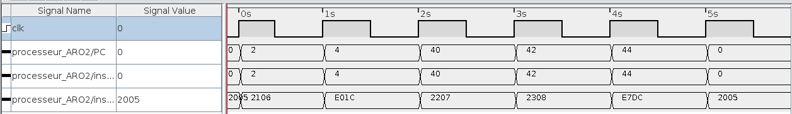
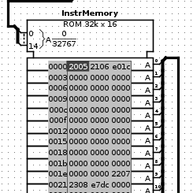

# Laboratoire FETCH - Gwendal Piemontesi & Guillaume Trüeb

## Question 1
### Quel est la valeur de l’incrément du PC dans ce processeur ? Justifier votre réponse.
La valeur est 2 car le nombre de bytes de l'instruction est de 2. Il y a une correspondance entre la valeur d'incrément et la taille en *bytes* de l'instruction.

## Question 2
### Relever et analyser le chronogramme. Veiller à bien expliquer ce que vous observez, vous pouvez annoter le chronogramme.
|Chronogramme|Résultat|
|---|---|
|||

## Question 3
### Relever et analyser le chronogramme. Veiller à bien expliquer ce que vous observez, vous pouvez annoter le chronogramme.
|Chronogramme|Résultat|
|---|---|
|||

## Question 4
### L’adresse de saut contenue dans les instructions de saut conditionnel et inconditionnel est une valeur signée ou non signée ? Justifier votre réponse.
Si la valeur de l'offset dans la partie offset de l'instruction était non signée, il serait impossible de revenir en arrière dans les instructions. Dans ce cas, la seule alternative serait de se fier à un overflow du PC, ce qui présente le risque de ne pas atteindre la destination souhaitée.
