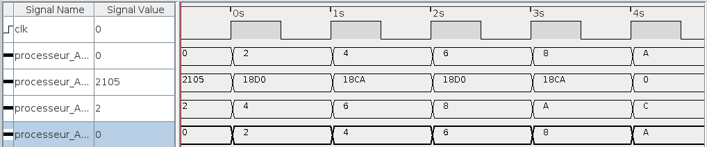

# Laboratoire FETCH - Gwendal Piemontesi & Guillaume Trüeb

## Question 1
La valeur est 2 car le nombre de bytes de l'instruction est de 2. Il y a une correspondance entre la valeur d'incrément et la taille en *bytes* de l'instruction.

## Question 2
|Valeurs de base|Résultat|
|---|---|
|||

## Question 3

## Question 4
