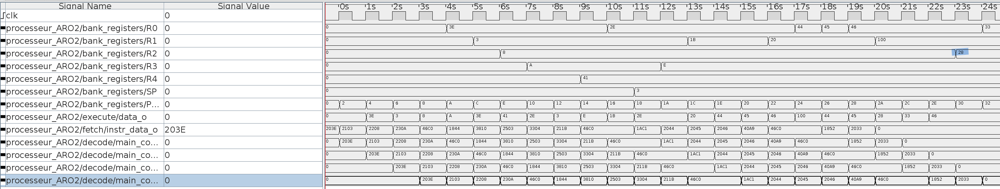

# Labo 4 PipeLine Analyse - G.Piemontesi G.Trueb
## Question 1
### Le programme complet s’exécute-t-il correctement avec les bonnes valeurs obtenues dans les registres ? Si des valeurs ne correspondent pas aux résultats attendu, identifier les et annoter le chronogramme.


```assembly
@ programme 1 - Le programme comprend 3 erreurs !
mov r0,#0x3E
mov r1,#3
mov r2,#8
mov r3,#0xa
add r4,r0,r1 @ MISTAKE
sub r0,#0x10
mov r5,#3
add r3,#4
mov r1,#27
sub r1,r0,r3 @ MISTAKE
mov r0,#0x44
mov r0,#0x45
mov r0,#0x46
lsl r1,r5
add r2,r1 @ MISTAKE
mov r0,#0x33
```

## Question 2
### Le programme complet s’exécute-t-il correctement avec les bonnes valeurs obtenues dans les registres ? Si des valeurs ne correspondent pas aux résultats attendu, identifier les et annoter le chronogramme.

```assembly
@ programme 2 - Le programme comprend 2 erreurs !
mov r0,#0x3E
mov r1,#3
mov r2,#8
mov r3,#0xa
nop
add r4,r0,r1
sub r0,#0x10
mov r5,#3
add r3,#4
mov r1,#27
nop
sub r1,r0,r3 @ MISTAKE
mov r0,#0x44
mov r0,#0x45
mov r0,#0x46
lsl r1,r5
nop
add r2,r1 @ MISTAKE
mov r0,#0x33
```

## Question 3
### Le programme complet s’exécute-t-il correctement avec les bonnes valeurs obtenues dans les registres ? Si des valeurs ne correspondent pas aux résultats attendu, identifier les et annoter le chronogramme.

```assembly
@ programme 3 - Le programme comprend 1 erreur !
mov r0,#0x3E
mov r1,#3
mov r2,#8
mov r3,#0xa
nop
add r4,r0,r1
sub r0,#0x10
mov r5,#3
add r3,#4
mov r1,#27
nop
nop
sub r1,r0,r3
mov r0,#0x44
mov r0,#0x45
mov r0,#0x46
lsl r1,r5
nop
nop
add r2,r1 @ MISTAKE
mov r0,#0x33
```

## Question 4
### Le programme complet s’exécute-t-il correctement avec les bonnes valeurs obtenues dans les registres ? Si des valeurs ne correspondent pas aux résultats attendu, identifier les et annoter le chronogramme.Que pouvez vous remarquer entre le nombre de NOP utilisés, leurs position dans le programme, et le lien avec les instructions d’avant ou d’après ?

```assembly
@ programme 4 - Le programme comprend 0 erreur !
mov r0,#0x3E
mov r1,#3
mov r2,#8
mov r3,#0xa
nop
add r4,r0,r1
sub r0,#0x10
mov r5,#3
add r3,#4
mov r1,#27
nop
nop
sub r1,r0,r3
mov r0,#0x44
mov r0,#0x45
mov r0,#0x46
lsl r1,r5
nop
nop
nop
add r2,r1
mov r0,#0x33
```
On peut voir que les nops ont leurs importances et permettent de "synchroniser" le programme pour que celui-ci marche de manière pipeliné. Ils permettent aussi de laisser le temps le temps aux données d'arriver au bon endroit à temps et de ne pas "louper le train" du programme.
