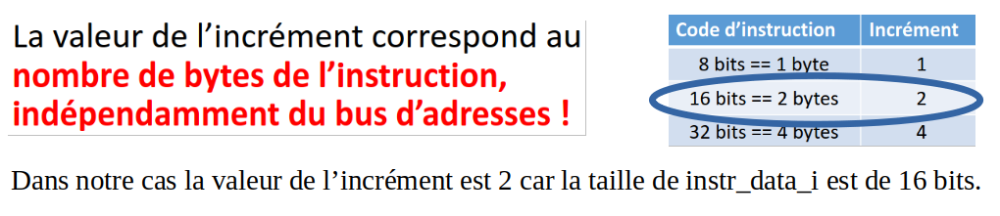
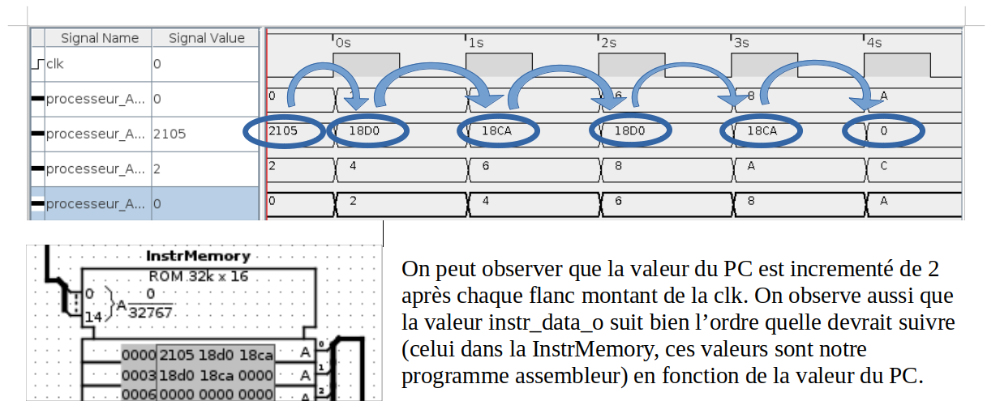
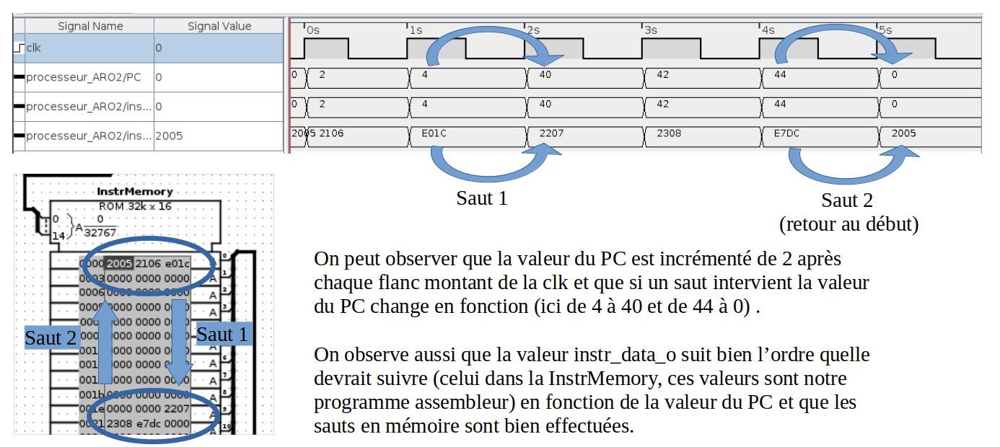
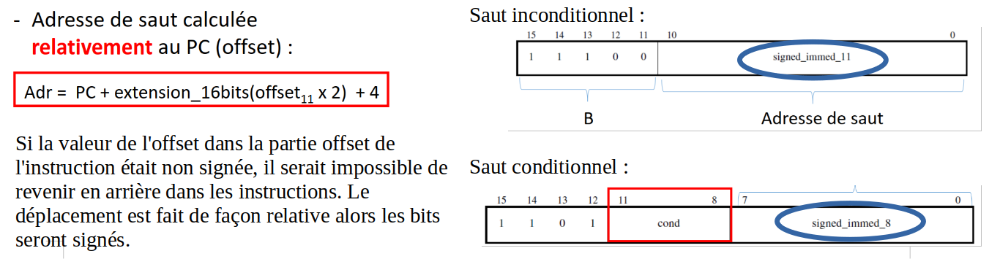

# Laboratoire FETCH - Gwendal Piemontesi & Guillaume Trüeb

## Question 1
### Quel est la valeur de l’incrément du PC dans ce processeur ? Justifier votre réponse.

## Question 2
### Relever et analyser le chronogramme. Veiller à bien expliquer ce que vous observez, vous pouvez annoter le chronogramme.

## Question 3
### Relever et analyser le chronogramme. Veiller à bien expliquer ce que vous observez, vous pouvez annoter le chronogramme.

## Question 4
### L’adresse de saut contenue dans les instructions de saut conditionnel et inconditionnel est une valeur signée ou non signée ? Justifier votre réponse.

